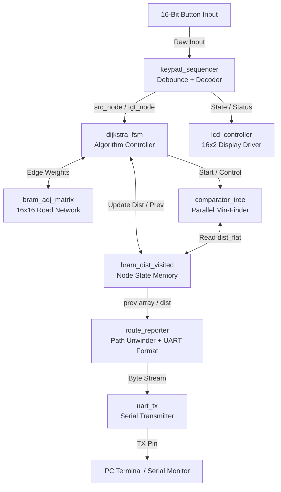

# FPGA-Based Hardware Dijkstra's Pathfinding Engine

## 📖 1. Project Overview

The **FPGA-Based Hardware Dijkstra's Pathfinding Engine** is an interactive, fully digital hardware accelerator that computes the shortest path between 16 interconnected geographical nodes (representing real-world towns in coastal Karnataka, India) using Dijkstra's algorithm. 

Unlike software implementations that evaluate nodes sequentially, this engine uses a parallel hardware comparator tree to compute minimum distances in $O(\log_2 N)$ cycles, dramatically reducing latency[cite: 3]. The system features:
* **Direct Hardware User Interface:** Uses a 16-bit one-hot keypad array for selecting source and target nodes, complete with hardware debouncing and multi-press detection.
* **Interactive LCD Display:** An on-chip controller drives a 16x2 HD44780 character LCD to report real-time system status and user prompts.
* **Automated Route Tracing & Reporting:** Automatically unwinds the shortest path using a back-pointer array, converts town IDs to ASCII strings, and streams the full route alongside the total calculated metric distance (in km) over a parameterized UART serial connection.

---

## 🏛️ 2. Design and Architecture

### System Architecture
The design is structured as a decoupled control-data-path system. Top-level integration manages the flow of data between the user input sequencer, the core algorithmic solver (FSM + Comparator Tree), and external display/serial reporting peripherals.

